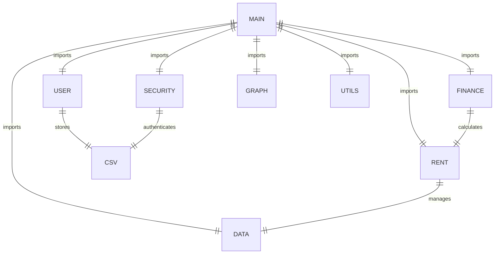

# House Rental Application

Welcome to the House Rental Application! This Python-based program allows users to browse available houses and flats for rent, place bids, calculate rent payments, and visualize rent prices through graphical representations.

## Features
- **User Registration and Authentication**
- **House/Flat Listings**
- **Bidding System**
- **Rent Payment Calculation**
- **Graph Visualization of Rent Prices**
- **User Data Storage (CSV)**

---

## Table of Contents
- [Installation](#installation)
- [Directory Structure](#directory-structure)
- [Usage](#usage)
- [Dependencies](#dependencies)
- [How to Run](#how-to-run)
- [Graph Visualization](#graph-visualization)
- [Saving User Data](#saving-user-data)
- [Troubleshooting](#troubleshooting)

---

## Installation

### Step 1: Clone the Repository
```bash
git clone https://github.com/YOUR_USERNAME/house-rental-app.git
cd house-rental-app
```

### Step 2: Create and Activate Virtual Environment (Optional but Recommended)
```bash
# On Windows
python -m venv venv
venv\Scripts\activate

# On Mac/Linux
python3 -m venv venv
source venv/bin/activate
```

### Step 3: Install Required Dependencies
```bash
pip install -r requirements.txt
```

---

## Directory Structure


---

## Usage

### Running the Application
```bash
python main.py
```

1. **Register** if you are a new user or log in if you are already registered.
2. **Choose from the menu** to view available houses, bid for rent, calculate payments, or visualize rent prices.
3. **Exit** the application at any time.

---

## Dependencies
- Python 3.7 or higher
- Matplotlib (for graph visualization)
- CSV (for user data storage)

To install dependencies:
```bash
pip install matplotlib
```

---

## How to Run

1. Run the `main.py` file to start the application.
2. Follow the prompts to register or log in.
3. Use the menu to navigate the available features.

---

## Graph Visualization

To visualize rent prices by location:

- Choose **"View Rent Graph"** from the menu.
- A bar chart will display rent prices by different locations (Downtown, Suburbs, City Center).

---

## Saving User Data

- User details are saved in `users.csv`.
- Each time a user registers, their data is appended to the CSV file.

---

## Troubleshooting

### ModuleNotFoundError: No module named 'matplotlib'
```bash
pip install matplotlib
```

### Authentication Failed
- Ensure that you register first before trying to log in.
- If authentication fails, check if the correct National ID and password are entered.

---

## Contributing
Feel free to contribute by opening issues or submitting pull requests.

---

## License
This project is licensed under the MIT License.

---

## Contact
For inquiries, please reach out to: [Zarin](ztasnimdia@gmail.com)
